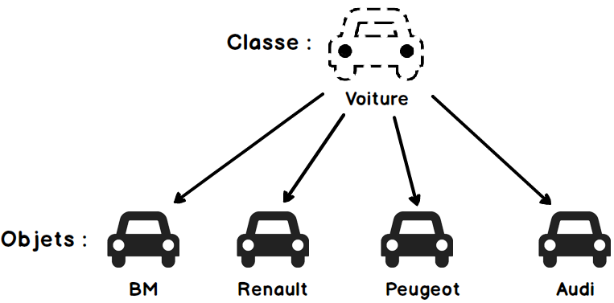
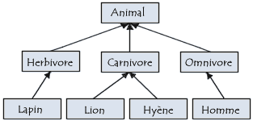
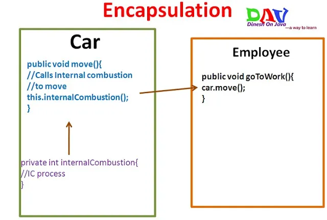

# day 3 Daily Java Drip(DJD)
## Objectif Global:
Ce cours fait partie d'un ensemble d'une séance de de cours sur le angage JAVA et qui va me permettre de réviser les base du langage.
Je partagerai quotidiennement les différentes parties de cette séance.
### Objectif du jour(Programmation orientée objet)
C'est quoi POO Java ?

La programmation orientée objet, ou POO, est un modèle de programmation qui repose sur le concept de classes et d'objets. Elle est utilisée pour structurer un programme logiciel en éléments de code simples et réutilisables, généralement appelés classes, qui sont utilisés pour créer des instances individuelles d'objets.
## Les classes
Une classe est le support de l'encapsulation : c'est un ensemble de données et de fonctions regroupées dans une même entité. Une classe est une description abstraite d'un objet. Les fonctions qui opèrent sur les données sont appelées des méthodes. Instancier une classe consiste à créer un objet sur son modèle. Entre classe et objet il y a, en quelque sorte, le même rapport qu'entre type et variable.

Java est un langage orienté objet : tout appartient à une classe sauf les variables de types primitives.

Pour accéder à une classe il faut en déclarer une instance de classe ou objet.

Une classe comporte sa déclaration, des variables et les définitions de ses méthodes.

Une classe se compose de deux parties : un en-tête et un corps. Le corps peut être divisé en 2 sections : la déclaration des données et des constantes et la définition des méthodes. Les méthodes et les données sont pourvues d'attributs de visibilité qui gèrent leur accessibilité par les composants hors de la classe.

## Les Objets
Les objets contiennent des attributs et des méthodes. Les attributs sont des variables ou des objets nécessaires au fonctionnement de l'objet. En Java, une application est un objet. La classe est la description d'un objet. Un objet est une instance d'une classe. Pour chaque instance d'une classe, le code est le même, seules les données sont différentes à chaque objet.

## Heritage
L'héritage est un concept fondamental en Java qui permet de réutiliser du code de la classe mère.

## Les constructeurs:
Pour créer un objet afin d'utiliser une nouvelle instance vous aurez besoin d'une méthode en sorte de constructeur qui permet de construire un objet qui sera utiliser par la suite.

## Encapsulation
En java, les modificateurs d'accès sont utilisés pour protéger l'accessibilité des variables et méthodes.

## Polymorphisme
Concept basé sur la notion de redéfinition de méthode:
- Plusieurs méthodes avec le meme nom et des signatures différents au sein de la meme classe.
- Une méthode porte le meme nom dans la classe mère et la classe fille avec des signatures différentes.

